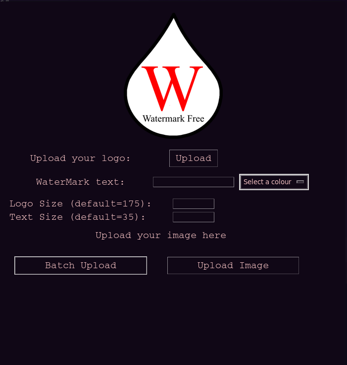
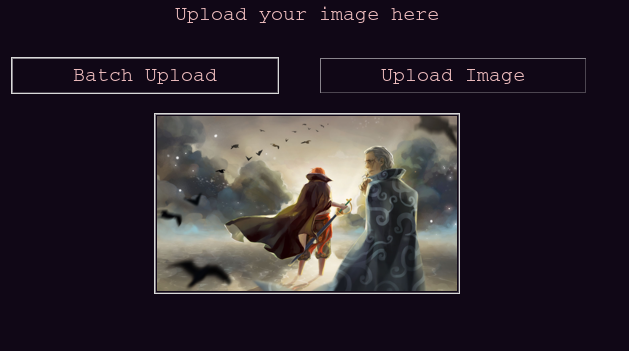
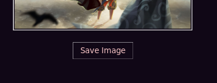

<h1 align='center'>💧 WaterMark</h1>

<h4 align='center'>A simple tool to watermark your images for free.</h4>

<br>


- [Live](youtube video) demonstration video.
- [Demo](https://replit.com/@KingCao/WaterMark?v=1) the Project.


<!-- ABOUT THE PROJECT -->
## About The Project

Have you ever wanted to just simply watermark your images before posting them? So did I, however, I saw a lot 
of paid options and thought, man, I could just make this myself. Introducing WaterMark.

How is this different from other programs you may ask? Well, I made it for one :). 

Another powerful feature of this program is that you can Batch Upload your images and the same watermark will
be applied to all of them! This will save you a lot of time if you have a lot of photos you want to watermark.

### Built With

Python3

Packages:
- Tkinter
- Pillow

<!-- GETTING STARTED -->
## Getting Started

The following instructions will help you get set up locally. Don't hesitate to message me if you have any problems!

### Prerequisites

- [python 3](https://www.python.org/downloads/)
- The [python installer package installer](https://pip.pypa.io/en/stable/installation/): `pip` (used to install required dependencies)
```sh
python -m ensurepip --upgrade
```

### Installation

1. Clone the repo
```sh
git clone https://github.com/dave-cao/WaterMark.git
```
3. Install pip packages
```sh
pip install -r requirements.txt
```

<!-- USAGE EXAMPLES -->
## Usage

1. Run the application
```sh
python3 main.py
```

2. You should be met with the following image.


3. Upload your logo and / or input your watermark text. Your logo will automatically be scaled to fit to size by default

4. Now upload the image you want to watermark. If it's only a single image then click `Upload Image`. If it's multiple, you can go for the `Batch Upload`.

    - If you go for the `Upload Image` option, you will be presented with a clickable image your upload. Click the image and a preview of your watermark will be presented to you.
        - 
    - If you want to save your watermark, another button should appear at the button. Simply click it and your image will be saved suffixed with `_watermarked`.
        - 

5. If you go for the `Batch Upload` option, you will not get image previews. All you have to do is choose all your images, click ok, and wait. You should then get a `Success` message. If you look back inside your folder, a `watermarked/` folder should be present. Inside will be all your watermarked images.

6. Exit application
```
ctl + c
# or click the "x" button.
```

_For a more comprehensive example of using this application, refer to this [video](example video here)_


<!-- ROADMAP -->
## Roadmap

Currently there is no future plans for this project. Some future ideas that I had while thinking of this project though:
1. Where it stands, the logo goes on the top left and the text goes on the bottom left. Perhaps in the future I can build an option to change the positions.
2. Only two text colours available, "White" and "Black".


<!-- CONTRIBUTING -->
## Contributing

Contributions are what make the open source community such an amazing place to learn, inspire, and create. Any contributions you make are **greatly appreciated**.

If you have a suggestion that would make this better, please fork the repo and create a pull request. You can also simply open an issue with the tag "enhancement".
Don't forget to give the project a star! Thanks again!

1. Fork the Project
2. Create your Feature Branch (`git checkout -b feature/AmazingFeature`)
3. Commit your Changes (`git commit -m 'Add some AmazingFeature'`)
4. Push to the Branch (`git push origin feature/AmazingFeature`)
5. Open a Pull Request


<!-- CONTACT -->
## Contact

#### David Cao
- Email: sirdavidcao@gmail.com
- [Youtube](https://www.youtube.com/channel/UCEnBPbnNnqhQIIhW1uLXrLA)
- [Linkedin](https://www.linkedin.com/in/david-cao99/)
- Personal Website: https://davidcao.xyz/
- Project Link - https://github.com/dave-cao/WaterMark


